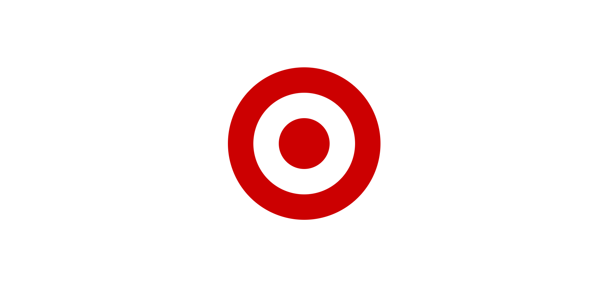
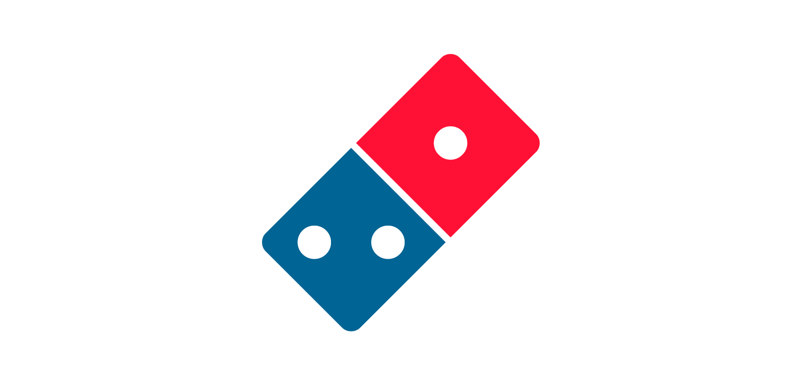
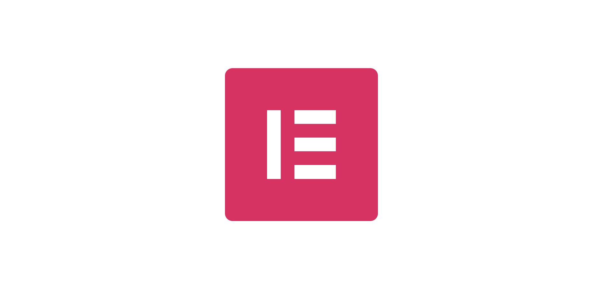

# CSS-Art 🎨
Hier zijn enkele CSS Art-projecten die ik zelf heb gemaakt.
## Windows Logo 🎨 (Geen position absolute) [Link](https://www.lekkerensimpel.com/basisrecept-voor-pannenkoeken/)

## Target Logo 🎨 (Geen position absolute) [Link](https://www.lekkerensimpel.com/basisrecept-voor-pannenkoeken/)

## Domino's Logo 🎨 (Geen position absolute) [Link](https://www.lekkerensimpel.com/basisrecept-voor-pannenkoeken/)

## Gemeente Amsterdam Logo 🎨 (Geen position absolute) [Link](https://www.lekkerensimpel.com/basisrecept-voor-pannenkoeken/)

## Elementor Logo 🎨 (Geen position absolute) [Link](https://www.lekkerensimpel.com/basisrecept-voor-pannenkoeken/)

## Cassettebandje 🎨 [Link](https://www.lekkerensimpel.com/basisrecept-voor-pannenkoeken/)

## Homer Simpson 🎨 [Link](https://www.lekkerensimpel.com/basisrecept-voor-pannenkoeken/)

## Minion 🎨 [Link](https://www.lekkerensimpel.com/basisrecept-voor-pannenkoeken/)

