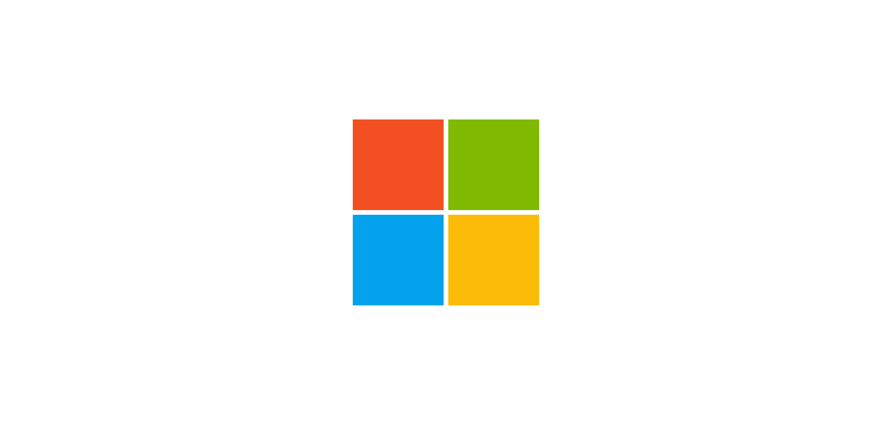

# CSS-Art 🎨
Hier zijn wat CSS Art projecten die ik zelf gemaakt heb
## Windows Logo 🎨 [Link](https://www.lekkerensimpel.com/basisrecept-voor-pannenkoeken/)

## Target Logo 🎨 [Link](https://www.lekkerensimpel.com/basisrecept-voor-pannenkoeken/)

## Domino's Logo 🎨 [Link](https://www.lekkerensimpel.com/basisrecept-voor-pannenkoeken/)

## Cassettebandje 🎨 [Link](https://www.lekkerensimpel.com/basisrecept-voor-pannenkoeken/)

## Homer Simpson 🎨 [Link](https://www.lekkerensimpel.com/basisrecept-voor-pannenkoeken/)

## Minion 🎨 [Link](https://www.lekkerensimpel.com/basisrecept-voor-pannenkoeken/)

